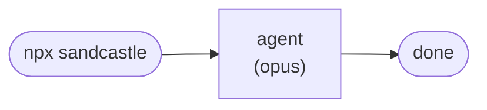
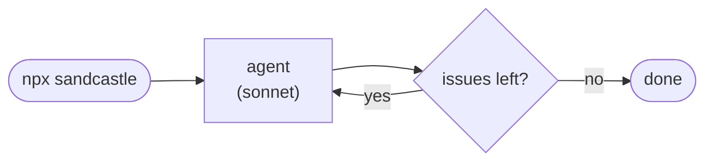
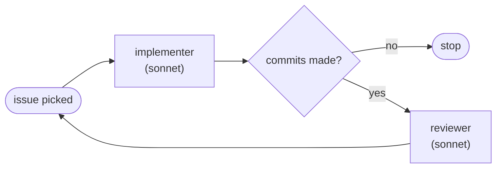
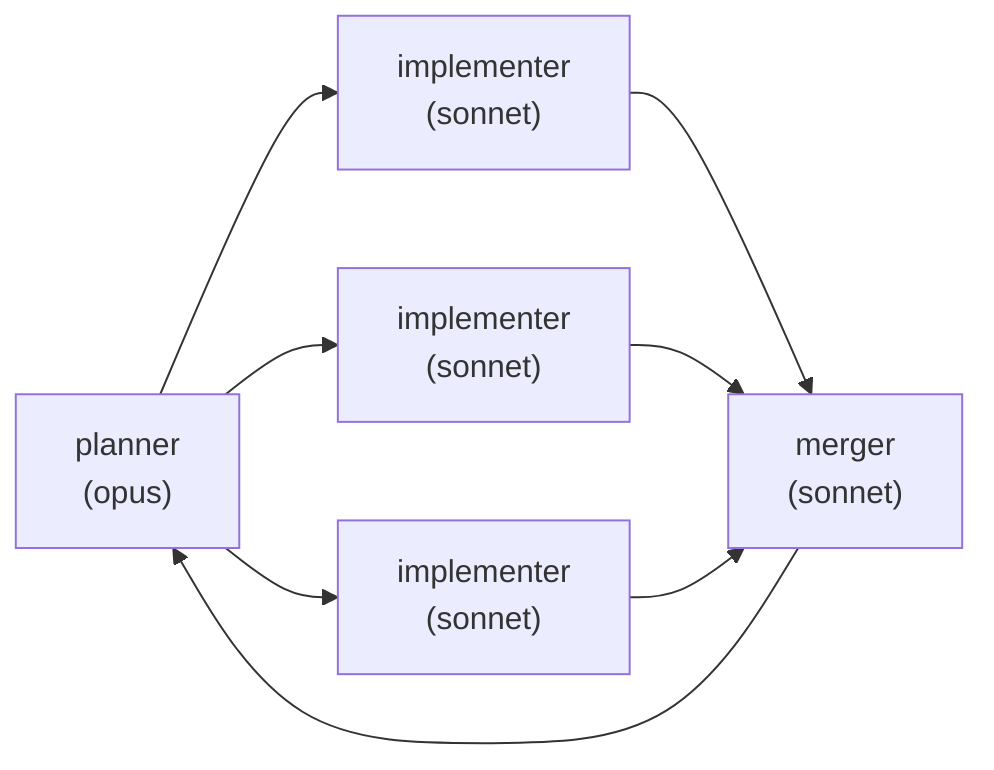
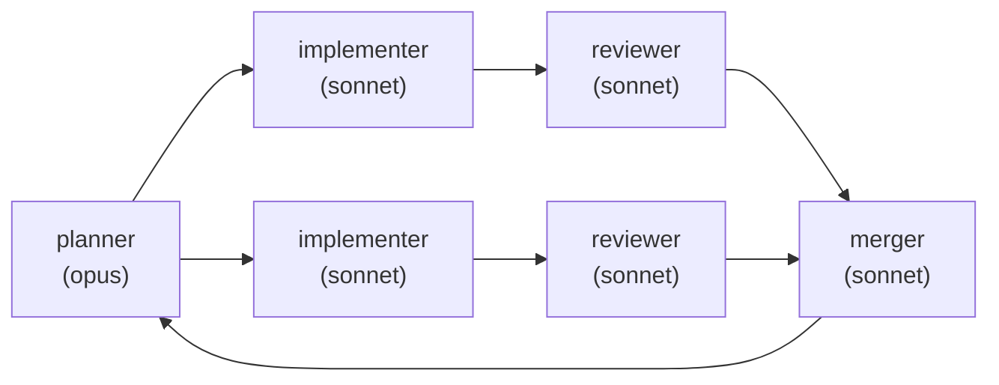

::title::
SandcastleAI

::subtitle::
18 september 2026
Ruurd Moelker

---
hideInToc: true
---

# Agenda

<Toc />

---
layout: section
---

# Why SandcastleAI

---

1. Permission nag or `--dangerously-skip-permissions`
2. Orchestrating your workflow is pretty clearly the next step up.

<!-- Why use sandcastle?
Because you either get way to many nags, or have to accept nearly unnaccetable risks.
-->

---
layout: section
---

# Sandcastle intro

---

<!-- TODO: info from https://github.com/mattpocock/sandcastle -->


---
layout: section
level: 2
---

# Beads

---
hideInToc: true
---

## Beads: the story

> "Coding agents *always* start off strong. Give an agent a modestly meaty task, and it will declare:
>
> 'Oh wow, this is a big project, I'm going to break it into **six phases** and create a markdown plan.'"

<v-clicks>

1. Phase 1
2. Phase 2
3. Phase 3
4. Phase 4
5. Phase 5
6. Phase 6

</v-clicks>

<!--
Source: https://steve-yegge.medium.com/introducing-beads-a-coding-agent-memory-system-637d7d92514a
-->

---
hideInToc: true
---

# Phase 1

The agent works through it. ✅ Done.

<br/>

Confidence is high. The plan is holding up.

<!--
TODO
-->

---
hideInToc: true
---

# Phase 2

Also done. ✅

<br/>

Then... several **compactions / restarts** happen, which resets the agent's memory.

<!--
TODO
-->

---
hideInToc: true
---

# Phase 3

The agent wakes up. It has mostly **forgotten where it came from**.

It plops in your video cassette, reads about "phase 3", and declares:

> "Oh wow, this is a big project, I'm going to break it into **five phases** and create a markdown plan."

<br/>

...and the fractal collapse repeats, nested sub-phases deep, until:

> "Congratulations, the system is DONE! 🎉 Let's start manual testing! 🚀"

— completely unaware the original outer phases are still unfinished. Hundreds of half-built markdown plans pile up in the repo.

<!--
TODO
-->

---
hideInToc: true
---

# What Beads provides

Started by **Steve Yegge**.

<v-clicks>

- Go
- 
- Temporal not good enough 
- Replaces the TODO list with **Beads issues**
- Issues written into **JSONL** lines
- Multi-agent **parallel support** (Dolt backend)
- Beads are the grapes on a vine — or beads on a chain 📿
- `bd` cli also stands for "**b**ug **d**atabase"
- Born out of large vibe-coding projects
- Work that gets too complex gets flagged **"rewrite only"**
- Agents drift into "**executive mode**" near the end of the context window and take shortcuts to a solution
- 

</v-clicks>

<!--
TODO: find images — beads logo? generic AI images? something specific to the site's case
-->

---
hideInToc: true
---

# Testimonials

<div class="text-sm">

> I've worked with Beads for less than a week, but the difference from markdown-based TODO tracking is **profound**…
>
> Markdown plans are **write-only memory for agents**… dependencies exist only in prose… I can't query for ready work, I have to *interpret* text…
>
> **Dependencies are first-class, not prose.** I run `bd ready --json` and get a definitive list of unblocked work… I'm not interpreting text, I'm *querying structured data*…
>
> Beads isn't "issue tracking for agents" — it's **external memory for agents**…
>
> Going back to markdown TODOs feels like trying to remember a phone number without writing it down… Sure, I can do it for a little while, but why would I?
>
> **— Sonnet 4.5**

</div>

<!--
Full text: see .local/slide_input.md, Appendix A
-->

## Sandcastle templates

There are a couple of defaults to choose from, each `npx @ai-hero/sandcastle init .` scaffolds a `.sandcastle/main.mts` orchestration script plus prompt files.

<!--
Source: https://github.com/mattpocock/sandcastle/tree/main/src/templates
-->

---
hideInToc: true
---

## blank



<!--
Bare scaffold — write your own prompt and orchestration.
Single run, maxIterations: 1 by default, no branch/merge logic — you own everything.
-->

---
hideInToc: true
---

## simple-loop



<!--
Picks issues one by one and closes them.
maxIterations: 3+, branchStrategy: merge-to-head — each iteration works one issue and merges straight back to HEAD.
-->

---
hideInToc: true
---

## sequential-reviewer



<!--
Implements issues one by one, with a code review step after each.
Implementer and reviewer share one sandbox instance and branch, so the reviewer can fix issues directly on top.
Loop stops early once an implement phase produces no commits (backlog empty).
-->

---
hideInToc: true
---

## parallel-planner



<!--
Plans parallelizable issues, executes on separate branches, merges.
Planner outputs a <plan> JSON (issue id, title, target branch) validated with Zod.
Implementers run concurrently via Promise.allSettled — one failing agent doesn't cancel the others.
Only branches with commits are passed to the merger; loop repeats to pick up newly unblocked issues.
-->

---
hideInToc: true
---

## parallel-planner-with-review



<!--
Plans parallelizable issues, executes with per-branch review, merges.
Each issue gets its own sandbox — implementer runs first, reviewer only runs if commits were made, same branch.
Combines the review gate of sequential-reviewer with the concurrency of parallel-planner.
-->

---
hideInToc: true
layout: section
---

## My template experience

---

### Sequential reviewer

TODO: AI, add side by side slide, image: sequential-reviewer-run.png

* One iteration even when stating "Break down problem into smaller chunks"
* Code not in main after run
  * Required `git merge sandcastle/sequential-reviewer/1789296860039`

---

### Sequential reviewer result

TODO: ai, add image sequential-reviewer-result.png

---
layout: section
---

# Demo time

---
hideInToc: true
---

## Demo config

<RunnerConfig />

---
hideInToc: true
runnable: true
layout: two-cols
---

## 1, Setup 

* `git init`
* `npm init`
* `npm install --save-dev @ai-hero/sandcastle`
* `npx @ai-hero/sandcastle init` with
  * github copilot
  * empty template
* Reset
* `npx @ai-hero/sandcastle init` with
  * claude
  * sequential-reviewer
    
<!--
show repo after empty template init and show main code with github copilot.
show repo prompts with sequential reviewer and show main code.
-->

---
runnable: true
layout: two-cols
---

## x, Ticket system, GH issues

1. Create fine-grained GitHub PAT: https://github.com/settings/personal-access-tokens/new
2. Repository access: select the target repo(s) individually — no name-pattern/wildcard scoping
3. Permissions:
   * Issues: Read and write
   * Metadata: Read-only (mandatory, auto-selected)
4. `GH_TOKEN=<token>` in `.sandcastle/.env`
5. Create Github repo and add origin
   1. `git remote add origin <github_repo>`
   2. `git push --set-upstream origin main`

<!--
Sandcastle's github-issues tracker only shells out to `gh issue list/view/close` (see
InitService.ts) — it never pushes or opens PRs, so Issues + Metadata is enough. Contents
(read/write) is only needed if your own orchestration pushes branches/PRs to origin.
-->


---
runnable: true
layout: two-cols
---

## 2, Config LLM: Claude

* `cp .sandcastle/.env{.example,}`
* Get token using `claude setup-token`
* edit `.sandcastle/.env`: `CLAUDE_CODE_OAUTH_TOKEN=<token>`

---
runnable: true
layout: two-cols
---

### 3. Install ticket system; npm installer

* `npm install @beads/bd`
  * Wrapper around go package installer
```
npm warn install-scripts 1 package had install scripts blocked because they are not covered by allowScripts:
npm warn install-scripts   fsevents@2.3.3 (install: (install scripts present))
npm warn install-scripts
npm warn install-scripts Run `npm install-scripts ls` to review, or `npm install-scripts approve <pkg>` to allow.
```

---
runnable: true
layout: two-cols
---

### 3b. Install ticket system; package manager

* https://beads.gascity.com/
* e.g.: `brew install beads`

---
runnable: true
layout: two-cols
---

### 4. Init tickets system

* `bd init`
  * "Hooks installed to: .beads/hooks/ "
  * "Created AGENTS.md with agent instructions"
  * "Created new CLAUDE.md with beads integration"
  * "Codex native hooks installed"
  * ...


## 5. Add starting ticket

* Agent swarm will use `bd ready --json`
* Provide source work with:
  * `npm i beads-ui -g`


## 6. Kick off Sandcastle

```
// const copyToWorktree = ["node_modules"];
const copyToWorktree = ["node_modules", ".beads"];
```

* `npm run sandcastle`
  * `npx tsx .sandcastle/main.mts`
* 

---
layout: section
---

# Try it out

---
hideInToc: true
---

# Goal

* Think of a small app, or
* An extension of your current project

Then

* Run through described setup steps
* Provide initial ticket(s)
* Run sandcastle loop `npx run sandcastle`


---
hideInToc: true
---

# Resources

- Beads introduction: https://steve-yegge.medium.com/introducing-beads-a-coding-agent-memory-system-637d7d92514a

---
hideInToc: true
---

## Enabling the demo runner

The run buttons on the Demo time slides are **off by default**. To enable them, set both before starting `npm run dev`:

* `SLIDEV_RUNNER_PARENT_PATH` — the directory demo commands are allowed to run in (and any subdirectory of it)
* `SLIDEV_RUNNER_SECRET` — a random secret, pasted into the "Demo config" slide to authorize requests

**Option A — exported env vars:**

```bash
export SLIDEV_RUNNER_PARENT_PATH=/path/to/allowed/parent
export SLIDEV_RUNNER_SECRET=$(openssl rand -hex 24)
npm run dev
```

**Option B — `.env` file** at the project root (already gitignored):

```
SLIDEV_RUNNER_PARENT_PATH=/path/to/allowed/parent
SLIDEV_RUNNER_SECRET=<random-secret>
```

Then paste the same `SLIDEV_RUNNER_SECRET` value into the secret box on the Demo config slide — commands will only run inside `SLIDEV_RUNNER_PARENT_PATH`, and only when both checks pass.

<!--
Neither var set -> the vite-plugins.ts runner middleware doesn't even register; /__runner/* just 404s
like any other route, so sharing this deck without these vars set is safe by default.
-->

# Thank you
