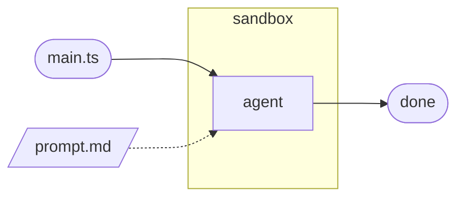
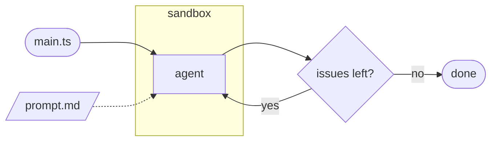
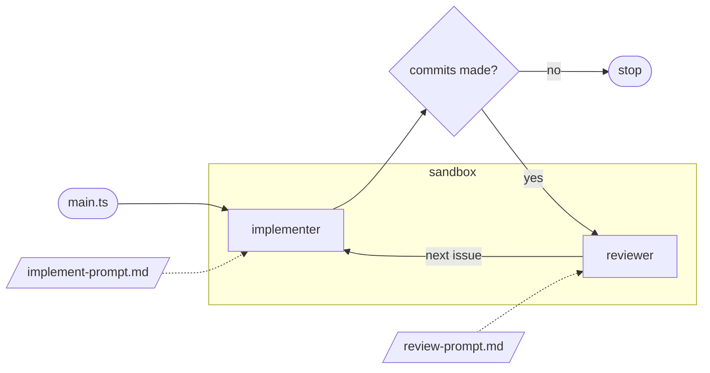
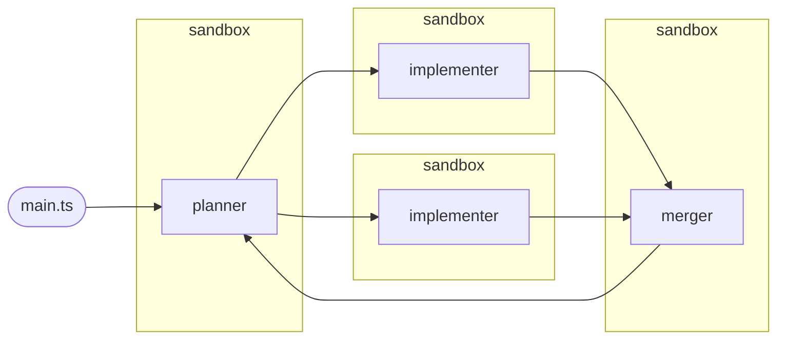
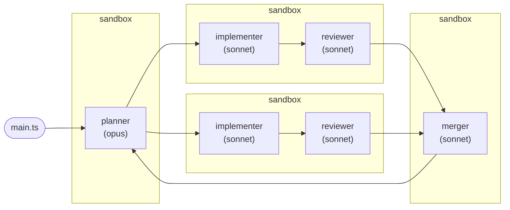

# Testimonials

> I've worked with Beads for less than a week, but the difference from markdown-based TODO tracking is **profound**…
>
> Markdown plans are **write-only memory for agents**… dependencies exist only in prose… I can't query for ready work, I have to *interpret* text…
>
> **Dependencies are first-class, not prose.** I run `bd ready --json` and get a definitive list of unblocked work… I'm not interpreting text, I'm *querying structured data*…
>
> Beads isn't "issue tracking for agents" — it's **external memory for agents**…
>
> Going back to markdown TODOs feels like trying to remember a phone number without writing it down… Sure, I can do it for a little while, but why would I?
>
> **— Sonnet 4.5**

<!--
Full text: see .local/slide_input.md, Appendix A
-->

## Sandcastle templates

There are a couple of defaults to choose from, each `npx @ai-hero/sandcastle init .` scaffolds a `.sandcastle/main.mts` orchestration script plus prompt files.

<!--
Source: https://github.com/mattpocock/sandcastle/tree/main/src/templates
-->

---
hideInToc: true
---

## blank

* Prompt is empty boilerplate.

<!--
Bare scaffold — write your own prompt and orchestration.
Single run, maxIterations: 1 by default, no branch/merge logic — you own everything.
-->

---
hideInToc: true
---

## simple-loop

* Prompt reads the next issue via `bd ready --json`.

<!--
Picks issues one by one and closes them.
maxIterations: 3+, branchStrategy: merge-to-head — each iteration works one issue and merges straight back to HEAD.
-->

---
hideInToc: true
---

## sequential-reviewer

* Each phase is still a **new Claude session** — implementer and reviewer don't share conversation context, only the branch's files/commits.

<!--
Implements issues one by one, with a code review step after each.
Loop stops early once an implement phase produces no commits (backlog empty).
-->

---
hideInToc: true
---

## parallel-planner

<!--
Plans parallelizable issues, executes on separate branches, merges.
Planner outputs a <plan> JSON (issue id, title, target branch) validated with Zod.
Implementers run concurrently via Promise.allSettled — one failing agent doesn't cancel the others.
Only branches with commits are passed to the merger; loop repeats to pick up newly unblocked issues.
-->

---
hideInToc: true
---

## parallel-planner-with-review

<!--
Plans parallelizable issues, executes with per-branch review, merges.
Each issue gets its own sandbox — implementer runs first, reviewer only runs if commits were made, same branch.
Combines the review gate of sequential-reviewer with the concurrency of parallel-planner.
-->

---
hideInToc: true
layout: section
---

## My template experience

---

### Sequential reviewer

TODO: AI, add side by side slide, image: sequential-reviewer-run.png

* One iteration even when stating "Break down problem into smaller chunks"
* Code not in main after run
  * Required `git merge sandcastle/sequential-reviewer/1789296860039`

---

### Sequential reviewer result

TODO: ai, add image sequential-reviewer-result.png

---

### Parallel planner

TODO: ai, add image on the right side: parallel-planner-wip-cli

* "Branches merged", no manual merge

<!-- https://github.com/RRMoelker/sandcastle-experiment-3 -->

---

TODO: ai, add image parallel-planner-wip-tickets

* Tickets my doing, not necesarry related to parallel planner template:
  * "As requested, broke the remaining work into smaller tickets rather than building the full game in this pass:"

---

TODO: ai, add image parallel-planner-result
TODO: ai add parallel-planner-result-cli.png
TODO: AI try to put both image on this slide
