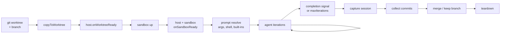
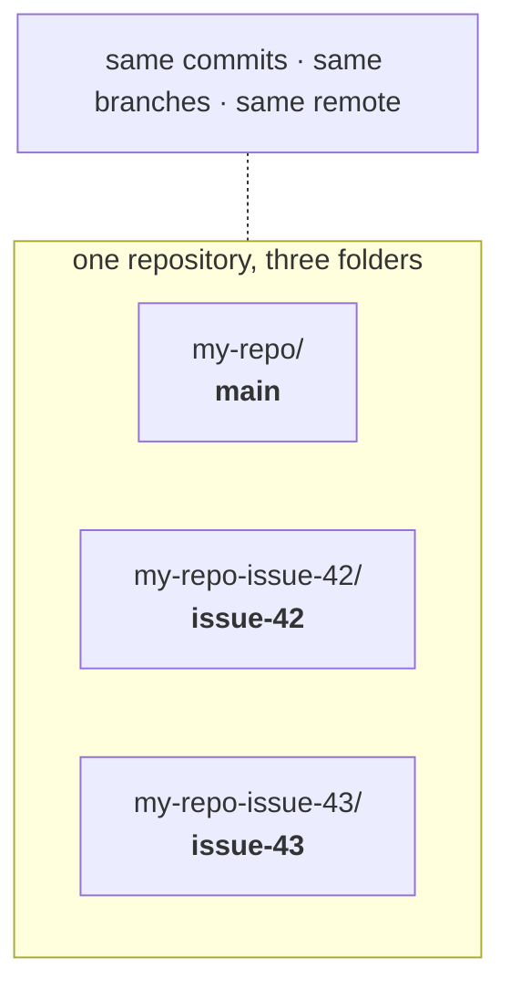
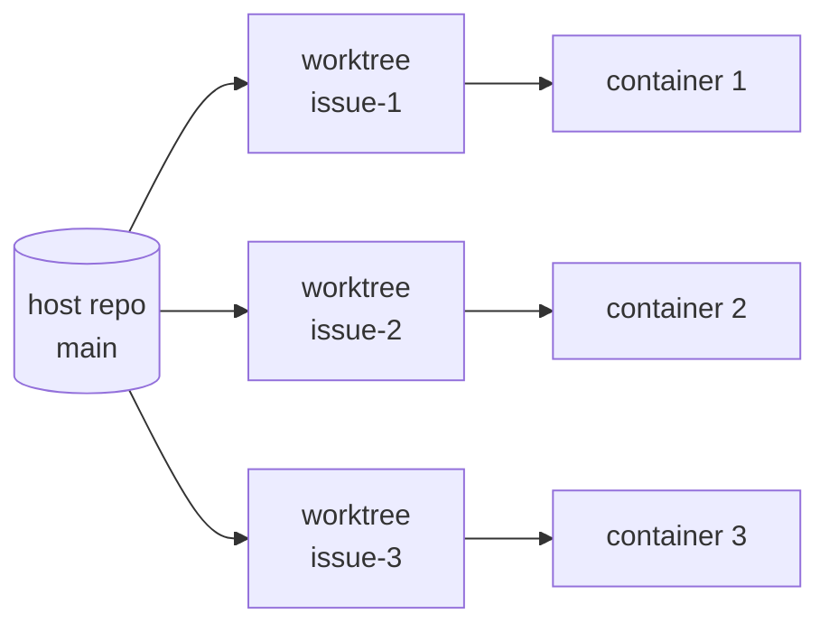

# Why SandcastleAI

---

1. Permission nag or `--dangerously-skip-permissions`
2. Orchestrating your workflow is pretty clearly the next step up.
   1. Teams
   2. Code review
   3. "better at evaluating than writing"<sup>[1]</sup>
3. Keep context low

<div class="mt-4 pt-2 border-t border-gray-500/30 text-xs opacity-60">

[1] Steve Yegge, Beyond Instructions podcast — <a href="https://youtu.be/s96O9oWI_tI?si=tLSN15ZAhhYRbare&t=1046" target="_blank">youtu.be/s96O9oWI_tI</a>

</div>

<!-- Why use sandcastle?
Because you either get way to many nags, or have to accept nearly unacceptable risks.
-->


---

**This is not hypothetical:**

<v-clicks>

* [Prompt injection tricked an AI wallet agent into transferring $150k–$200k in tokens](https://www.securityweek.com/prompt-injection-attacks-trick-ai-agents-into-making-crypto-payments/) — Morse-code-encoded X post, May 2026 (same wallet lost $330k to a similar attack in March 2025)
* [The Shai-Hulud npm worm infected 500+ packages](https://www.csoonline.com/article/4117139/from-typos-to-takeovers-inside-the-industrialization-of-npm-supply-chain-attacks.html) — including `chalk`, `debug`, `strip-ansi` — hunting for crypto wallets, Sept 2025
* [Mozilla PoC: a clean-looking GitHub repo silently opens a reverse shell in Claude Code](https://cybernews.com/security/claude-code-attack-prompt-injection-mozilla/) — zero malicious code visible in the repo itself

</v-clicks>


---
layout: section
---

# Sandcastle intro

<!--
So that's the problem. Now let's look at one answer to it.

For the next twenty minutes I want to build up a mental model of Sandcastle, piece by
piece: what it is, what happens when you press go, how work gets split up, how it gets
back together, and where you can actually see what happened. After that we look at the
five templates it ships with, and then we run one live.
-->


---

## What is Sandcastle?

> "Orchestrate sandboxed coding agents in TypeScript with `sandcastle.run()`"

<v-clicks>

* **Matt Pocock** (Total TypeScript / AI Hero) — public since **March 2026**, MIT, ~8k ⭐
* `npm i -D @ai-hero/sandcastle` — we are on **v0.12.0**
* A **library**, not a platform: no UI, no daemon, no cloud account
* Three promises:
  1. You invoke agents with a single `sandcastle.run()`
  2. Sandcastle sandboxes the agent with a configurable **branch strategy**
  3. The commits made on the branches get **merged back**

</v-clicks>

<!--
Sandcastle is by Matt Pocock — the Total TypeScript person — under his AI Hero label. The
repo went public in March this year, it's MIT licensed, and it has picked up about eight
thousand stars in six months. We're on version 0.12, so: pre-1.0, moving fast, expect the
API to shift under you.

The thing I want you to notice is the word *library*. There is no web UI, no daemon, no
account to create. You install an npm package. That puts it at the opposite end of the
spectrum from the hosted products — Devin, the cloud agent offerings — which own the whole
loop and hand you a dashboard. Here, you own the loop.

And the pitch is three sentences long: you call run(), it puts the agent in a box, and the
commits come back. Everything else in this section is detail underneath those three
sentences.
-->


---

## The mental model

```ts
await sandcastle.run({
  agent:   sandcastle.claudeCode("claude-sonnet-5"),   // who
  sandbox: docker(),                                   // where
  promptFile: "./.sandcastle/implement-prompt.md",     // what
  branchStrategy: { type: "branch", branch: "sandcastle/issue-42" }, // where it lands
  maxIterations: 100,
});
```

<v-clicks>

* One `run()` = **one container + one worktree + one fresh agent session**
* Your orchestration is a plain `.mts` file: `for`, `if`, `Promise.allSettled`
* Everything above the agent call is **your** code — Sandcastle owns only the box

</v-clicks>

<!--
If you remember one slide from this section, make it this one.

This is the whole API surface, near enough. Four questions: who runs — which agent and
model. Where it runs — which sandbox. What it does — the prompt. And where the code lands
— the branch strategy. Then a ceiling on how many turns it gets.

Now look at what is *around* that call. It's a TypeScript file. Which means your
orchestration is a for-loop, an if-statement, a Promise.allSettled. Not a YAML workflow,
not a DAG you declare to someone else's engine. You can put a breakpoint in it. You can
console.log it. You can unit-test the bits that aren't the agent.

That's why this tool is worth a training session: the orchestration layer is code you
already know how to write, so the interesting question stops being "how do I configure it"
and becomes "what shape should my pipeline be". Which is the actual hard question.
-->


---

## How are you expected to run it?

```bash
npx @ai-hero/sandcastle init      # agent + sandbox + issue tracker + template
npx tsx .sandcastle/main.mts      # AFK from here
```

<v-clicks>

* One-time: scaffold `.sandcastle/`, build the image, drop a token in `.env`
* Then it is just **`tsx` on a TypeScript file** — no CLI to learn, no server to run
* Your terminal, your Docker, your git. **100% local** by default.
* Every init prompt has a `--flag`, so the setup is CI-scriptable too
* `init` refuses to overwrite an existing `.sandcastle/` — new template → fresh repo

</v-clicks>

<div class="mt-4 text-sm opacity-70">Step-by-step setup: see the demo at the end.</div>

<!--
Two commands. The first one you run once per repo: it asks you four questions — which
agent, which sandbox, which issue tracker, which template — scaffolds a .sandcastle
directory, and builds the container image. You drop a token in the .env and you're done.

After that there is no CLI. You run a TypeScript file with tsx. That's it. Nothing is
listening on a port, nothing phones home, everything happens on your machine with your
Docker and your git.

Two practical notes. Every one of those init questions has a matching command-line flag,
so you can script the whole setup in CI. And init deliberately refuses to overwrite an
existing .sandcastle directory — so if you want to try a different template, do it in a
fresh repo rather than expecting init to migrate you.

I'm keeping this shallow on purpose — we walk the full setup with screenshots in the demo
at the end. Right now I only want the shape: initialise once, then run a script.
-->


---

## Anatomy of a run



* Hooks let you `npm install`, copy secrets, apt-get — *before* the agent starts.
* Fail fast: a non-zero hook or shell expression kills the run.

<!--
So what actually happens when you call run()? This is the whole lifecycle, and it's worth
walking left to right once, because almost every option you'll meet later hooks into one
of these boxes.

First Sandcastle makes a git worktree on a branch — hold that thought, we come back to
worktrees in a minute. Then it copies in the files git won't bring along, like
node_modules. Then your host hooks fire. Then the container starts, and the sandbox hooks
fire — that's your npm install, your apt-get.

Only *then* is the prompt resolved: arguments substituted, shell expressions expanded,
built-ins injected. Then the agent runs, possibly several iterations. It stops either
because it emitted the completion signal, or because it hit maxIterations.

Then the cleanup half: capture the session transcript, collect the commits, merge or keep
the branch, tear the container down.

Two things to take away. One: the hooks exist so the agent opens its eyes in a repo that
is already installed and ready — it shouldn't be spending turns on setup. Two: this thing
fails fast. A hook that exits non-zero, or a shell expression in your prompt that errors,
kills the run before the agent ever starts. That's a feature — you find out in five
seconds rather than after twenty minutes of confused agent.
-->


---

## How is information passed between stages?

Five channels — and **conversation context is not one of them** by default.

| Channel | Direction | Shape |
|---|---|---|
| `promptArgs` placeholders | orchestrator → agent | strings, substituted on the host |
| Shell expansion in prompt | repo → agent | stdout of a command, run **in the sandbox** |
| `Output.object()` | agent → orchestrator | tag + Zod-validated JSON, **typed** |
| Git commits / branches | agent → agent | the actual code |
| `resume()` / `fork()` | agent → agent | the session JSONL itself |

<!--
Once you have more than one agent, the interesting question is how they talk to each
other. There are exactly five channels, and I've put the direction next to each one.

Downwards, orchestrator to agent: prompt arguments — placeholders your TypeScript fills
in. Sideways, repo to agent: shell expressions in the prompt file, which run a command and
paste its output in. Upwards, agent back to orchestrator: structured output — the agent
emits tagged JSON, you get a typed object. And agent to agent: git commits, and session
resume or fork.

Now the line that matters most, and it catches everyone: conversation context is *not* on
this list. When your reviewer agent starts, it has never met the implementer. It has no
idea what the implementer was thinking, what it tried and abandoned, or why it made a
choice. It sees a branch, a diff, and whatever your prompt tells it.

That's partly a feature — genuinely fresh eyes, no anchoring on the first agent's
reasoning. But it has a hard consequence for how you design your pipeline: anything you
want carried from one stage to the next has to be written down somewhere durable. A
commit message. A ticket comment. A prompt argument. If it only exists in the first
agent's head, it's gone.
-->


---

## Passing information: the three prompt mechanisms

````md
# ISSUES
!`gh issue list --state open --label Sandcastle --json number,title,body`

Work on issue #{{TASK_ID}} — "{{ISSUE_TITLE}}" on branch {{BRANCH}}.
You are on {{SOURCE_BRANCH}}; diff against {{TARGET_BRANCH}}.
````

<!--
Here are three of those channels in one small prompt file — this is close to what the
parallel-planner template actually ships.

The line with the exclamation mark and backticks is a shell expression. Sandcastle runs
that command and pastes its stdout into the prompt. Note *where* it runs: inside the
sandbox, after your setup hooks — so it sees the repo exactly as the agent will, with
dependencies installed.

The double-brace placeholders are prompt arguments, filled from a plain object in your
TypeScript. That's how one prompt file gets reused for five issues in parallel.

And the last two are free: source branch and target branch are always injected, you never
pass them, and you're not allowed to override them.

The ordering matters and it's easy to get backwards: substitution happens first, on the
host — then the shell expressions run, in the sandbox. So a placeholder can appear inside
a shell command and it'll be filled in before the command runs.

Two guardrails. A placeholder with no value is a hard error, not a silently empty string —
which is what you want. And this is injection-safe in the direction that matters: if an
issue title someone wrote on GitHub happens to contain a shell expression, it arrives as
inert text. It is not executed.

The trap: none of this applies to an inline prompt string. Use promptFile, always.
-->


---

## Passing information: structured output

```ts
const plan = await sandcastle.run({
  name: "planner",
  maxIterations: 1,                       // required for structured output
  agent: sandcastle.claudeCode("claude-sonnet-5"),
  promptFile: "./.sandcastle/plan-prompt.md",
  output: sandcastle.Output.object({ tag: "plan", schema: planSchema }),
});

plan.output.issues.map((i) => i.id);      // typed, validated
```

<!--
That was information going down to the agent. This is the channel coming back up, and
it's the one that makes real orchestration possible.

You tell the agent to put its answer inside a tag — here, plan tags — and you hand
Sandcastle a schema. Zod in this example, but any Standard Schema validator works. The
agent writes JSON, Sandcastle pulls it out, validates it, and you get a typed object back.

Look at the last line. plan.output.issues — that's a real array with real types, that your
loop can iterate over and fan out on. That is the seam where a fuzzy language model turns
into a value a program can branch on. Without it, your orchestration is limited to "run
agent, hope, run next agent".

If the JSON is malformed or fails validation, you get a StructuredOutputError — and
usefully, that error still carries the session id, the commits and the branch, so nothing
is lost. Set maxRetries and Sandcastle handles the retry itself: it resumes the *same*
session and feeds back a short description of what was wrong, so the agent fixes its
output without redoing the work.

One constraint to remember: structured output requires maxIterations of one. Which makes
sense — you're asking a question, not running a work loop.
-->


---

## Intermezzo: what is a `git worktree`?

[//]: # TODO, put these  slides in their own file ()
[//]: # TODO, clarify with a image showing two folders on 2 different branches()

[//]: # TODO, maybe show:
```
main/.git    drwxr-xr-x   ← real directory
feat/.git    -rw-r--r--   ← a 192-byte *file*

The file contains one line:

gitdir: /…/main/.git/worktrees/feat

That's a "gitlink" — a pointer. Git reads it and redirects to the named directory.

What's in the main repo's .git/

COMMIT_EDITMSG  config  description  HEAD  hooks/  index  info/  logs/  objects/  refs/  worktrees/

Normal stuff, plus worktrees/ — one subdirectory per linked worktree.

What's in .git/worktrees/feat/
```

**The problem:** one clone = one folder = **one branch at a time**.

To touch another branch you `git switch` — and your files change underneath you. Uncommitted work? Stash it first.

<v-click>

**A worktree is a second folder on disk, checked out on a different branch, belonging to the same repo.**



</v-click>

<!--
Quick intermezzo, because the next slide does not land unless this one does. Worktrees are
a git feature a lot of people have simply never had a reason to use, so let's do it
properly.

Start from the thing you already know. A clone gives you one folder. That folder is on one
branch. If you want to work on a different branch, you switch — and the files in that
folder are rewritten in place. If you had uncommitted work, you stash it first. One folder,
one branch, always.

That is a real constraint the moment you want two things happening at once. The old
workaround was to clone the repo a second time — which downloads everything again, and then
you have two repos that don't know about each other.

A worktree is the proper answer. It is a second folder on your disk, checked out on a
different branch, and it belongs to the same repository. Look at the diagram: three folders,
three branches, all live at the same time — and one shared set of commits, branches and
remote underneath them.

So it is not a copy. Nothing is downloaded, nothing is duplicated. Creating one is
essentially instant, and you can throw it away just as cheaply.
-->


---

## `git worktree` in practice

```bash
git worktree add ../my-repo-issue-42 sandcastle/issue-42   # new folder, that branch
git worktree list                                          # show them all
git worktree remove ../my-repo-issue-42                    # tidy up
```

<v-clicks>

* Each folder keeps **its own uncommitted changes** — no stashing, no switching
* Commit in one folder → **immediately visible** in the others, it is one history
* A branch can be checked out in **only one** folder at a time (git refuses otherwise)
* ⚠️ You only get the files **git tracks** — `node_modules` and `.env` are *not* there

</v-clicks>

<div v-click class="mt-4 text-sm opacity-80">

Sandcastle creates one per agent under `.sandcastle/worktrees/`, and never asks you to type these.

</div>

<!--
Three commands, and in practice you'll mostly watch Sandcastle run them rather than type
them yourself. Add takes a folder path and a branch. List shows you what exists. Remove
cleans up.

Four things worth knowing once you have several of them.

Each folder holds its own uncommitted changes. That's the whole point: you can leave
half-finished work in one folder and go do something else in another, with no stashing and
no switching.

They do share history, though. Commit in one folder and that commit is instantly there for
the others — it is one repository with several windows onto it, not several repositories.

Git will refuse to check out the same branch in two folders at once. That sounds annoying
until you realise it's what stops two agents writing to the same branch simultaneously.

And the one that actually bites: a new worktree only contains files git tracks. So it has
no node_modules and no .env, because git has never heard of them. Every fresh worktree
starts as an uninstalled project.

Keep that last one in mind for the next slide — it explains a chunk of every Sandcastle
template.
-->


---

## How is code worked on independently?



<v-clicks>

* One **git worktree** per branch under `.sandcastle/worktrees/`, bind-mounted into its own container
* Agents never see each other's files — conflicts are deferred to the merge phase
* `Promise.allSettled` → one crashed agent does not cancel its siblings
* `copyToWorktree: ["node_modules"]` to skip a cold install per worktree
* Dirty worktree on close is **preserved on disk**, not deleted

</v-clicks>

<!--
And there's the answer to "how do three agents work on the same repo without destroying
each other". They don't share a directory at all. Each gets its own worktree, on its own
branch, bind-mounted into its own container.

So agent two literally cannot see agent one's files. Which means there are no conflicts
*during* execution — every conflict is deferred to one merge step at the end, where you
can deal with it deliberately instead of racing.

Three details that matter in practice. The fan-out uses Promise.allSettled, not
Promise.all — so if one agent crashes, the others keep going and you still collect their
work. Remember the tracked-files rule from the previous slide: that's why every template
sets copyToWorktree to node_modules, and *also* runs npm install in a hook — the copy
saves the cold install, the hook fixes up native binaries. And when a run closes with
uncommitted changes, the worktree is kept on disk rather than deleted, so you can go and
look at what the agent left behind.

One more thing worth knowing. If you re-run with the same branch name, Sandcastle reuses
the existing worktree and fast-forwards it from origin when that's safe. That's precisely
why the planner prompt insists on a deterministic branch name — sandcastle slash issue
dash id — so a second pass at the same issue picks up where the first left off instead of
starting from scratch.

If we have a run going during the demo, `git worktree list` on the host is a nice thing to
show live.
-->


---

## How is code merged? Branch strategies

| Strategy | What happens | Merge |
|---|---|---|
| `head` | Agent writes **straight into your working dir** | none needed |
| `merge-to-head` | Temp branch in a worktree, `git merge` back to HEAD, branch deleted | **automatic, deterministic** |
| `branch` | Commits land on a branch you name, worktree kept | **none — you decide** |

<v-clicks>

* Default: `head` for bind-mount (Docker/Podman), `merge-to-head` for isolated (Vercel)
* `head` is fast but gives up the safety net — that is the "no sandbox for your git" mode
* `branch` is what the parallel templates use, so an **agent** can do the merging

</v-clicks>

<!--
Work has been split up. Now it has to come back together, and that's the branch strategy —
one option, three values, and it decides everything about how the code returns to you.

Head means no worktree at all: the agent writes straight into your working directory. Fast,
no merge step, and no safety net — if it makes a mess, the mess is in your checkout. I'd
call this the "sandbox for the process, but not for your git" mode.

Merge-to-head is the safe default for anything unattended. Throwaway branch in a worktree,
git merge back to HEAD when it's done, branch deleted. If it goes wrong, your HEAD never
moved.

And branch just parks the commits on a name you chose and leaves the worktree alone. No
merge happens. That's not Sandcastle being lazy — it's what you want when something else
is going to do the merging, which is exactly the parallel case.

Note the defaults are per provider, and they differ: Docker and Podman default to head,
the isolated providers default to merge-to-head. So the same script can behave differently
depending on which sandbox you picked, unless you set the strategy explicitly. Which I'd
recommend you always do.
-->


---

## Is code merged automatically? Two answers

<div class="grid grid-cols-2 gap-4">
<div>

### Deterministic merge

`merge-to-head` → Sandcastle runs `git merge`.

* No LLM involved
* Conflict → the run fails
* You get HEAD or nothing

</div>
<div>

### Agent merge

`parallel-planner` → a **merger agent**.

* Prompted to `git merge --no-edit`
* "Resolve conflicts intelligently"
* Then `npm run typecheck && npm run test`
* Then close the tickets

</div>
</div>

<v-clicks>

* So: yes, automatic — but in the parallel templates a *model* is resolving your conflicts
* Only branches that actually produced commits are handed to the merger
* My run: "Branches merged", no manual merge needed. The sequential run needed a manual `git merge`.

</v-clicks>

<!--
"Is the code merged automatically?" — the honest answer is: yes, but there are two very
different things hiding behind that word, and you should know which one you've signed up
for.

On the left, the deterministic merge. Merge-to-head means Sandcastle itself runs git merge.
No model is involved. If there's a conflict, the run fails and you go and look. You get
HEAD, or you get nothing. Boring, predictable, auditable.

On the right, what the parallel templates actually do. They pass the branch names to a
*merger agent*, and the prompt tells it — I'm quoting the shipped template — to merge each
branch, resolve any conflicts intelligently, run typecheck and tests, fix what breaks, and
then close the tickets.

Sit with that for a second. That is a language model resolving merge conflicts in code it
did not write, with your test suite as the only gate. It is the single highest-risk step
in the whole pipeline, and it's the step people notice least, because when it works the
output is just a cheerful "Branches merged".

One nice bit of hygiene: only branches that actually produced commits get handed to the
merger, so empty runs don't create noise.

And from my own experience, which you'll see in a few slides: the parallel planner did
merge everything by itself and told me so. The sequential reviewer did not — its commits
sat on a timestamped branch and I had to run git merge by hand. That's not a bug, it's the
branch strategy of that template, but it's a surprise the first time.
-->


---

## Does the reviewer share the container?

| Template | Reviewer runs in | Sandbox reused? |
|---|---|---|
| `sequential-reviewer` | same container as implementer | ✅ `createSandbox()` |
| `parallel-planner-with-review` | same container as its implementer, one per issue | ✅ per branch |
| Separate `run()` calls | brand-new container each time | ❌ |

<v-clicks>

* `createSandbox()` keeps the container **warm**: deps installed, build cache intact, commits accumulate on one branch
* `sandbox.exec("npm test")` lets *your code* gate the review without spending an agent
* But the reviewer is always a **new agent session** — shared filesystem, not shared memory
* Cost of a fresh `run()`: container start + `npm install`, every single time

</v-clicks>

<!--
Next question: when a reviewer looks at an implementer's work, is that a fresh container or
the same one? It's your choice, and the two shipped review templates both choose "same".

The mechanism is createSandbox. Instead of run() spinning a container up and tearing it
down, you create the sandbox once and call run on it several times. The container stays
warm between calls — dependencies still installed, build cache intact, and commits from
every run pile up on the same branch. The parallel-planner-with-review does the same thing,
just once per issue: each branch gets a sandbox, and its implementer and reviewer share it.

The payoff is real. A fresh run() means container startup plus npm install, every single
time. With five issues and a review each, that's ten cold starts you didn't need.

There's a second payoff that's easy to miss: sandbox.exec. That lets *your TypeScript* run
a shell command in the warm sandbox — so you can run the test suite yourself, check the
exit code, and only spend an agent on review if the tests actually pass. Deterministic gate,
zero tokens.

But — and this is the callback to the information-passing slide — sharing a container is
not sharing a mind. The reviewer is still a brand new agent session. Same filesystem, same
branch, no shared memory. It reads the diff, not the implementer's reasoning.
-->


---

## Sandbox providers

| Provider | Type | Pro | Con |
|---|---|---|---|
| **Docker** | bind-mount | ubiquitous, fast, local, free | Desktop licence, daemon runs as root |
| **Podman** | bind-mount | rootless, daemonless, drop-in | less common on macOS, SELinux quirks |
| **Vercel** | isolated (Firecracker µVM) | real VM isolation, scales past your laptop, no local Docker | costs money, network round-trips, copy in/out |
| **Daytona** | isolated | managed dev-env infra | extra vendor + account |
| **no-sandbox** | none 😬 | zero setup, use for `interactive()` | it's just an agent on your machine |

<v-clicks>

* Bind-mount = worktree mounted in, **no file sync**. Isolated = provider copies code in and out.
* Custom provider = ~60 lines: `exec`, `close`, `copyFileIn/Out`, `worktreePath`

</v-clicks>

<!--
Now the two provider choices you make at init time. First, where the agent runs.

The important split isn't really the vendor names, it's the middle column: bind-mount
versus isolated. Bind-mount means the worktree on your disk is mounted into the container —
the agent writes through the mount, straight to your filesystem, and nothing needs syncing.
Isolated means the sandbox has its own filesystem somewhere else, and the provider copies
code in at the start and results out at the end.

Docker is the default and the safe choice: everyone has it, it's fast, it's free unless
you're a big company paying for Desktop. Podman is the same thing rootless and daemonless
— a genuine security improvement, slightly rougher outside Linux. Vercel gives you real
Firecracker micro-VMs: proper VM isolation, and it scales past what one laptop can hold —
but you're paying, and every file operation is a network round trip. Daytona is the other
isolated option. And no-sandbox does exactly what it says, which — given the slide we
opened this section with — should only ever be for interactive exploration.

My rule of thumb: Docker or Podman for local AFK runs; Vercel when you want to fan out
wider than your laptop, or when you genuinely don't trust the code being written.

And if none of those fit — a custom provider is about sixty lines. Four methods: exec,
close, copy a file in, copy a file out. That's the whole contract.
-->


---

## Issue tracker providers

`init` asks: **GitHub Issues**, **Beads**, or **Custom**. It only wires up three commands.

| | list | view | close |
|---|---|---|---|
| GitHub Issues | `gh issue list --label Sandcastle …` | `gh issue view <ID>` | `gh issue close <ID>` |
| Beads | `bd ready --json` | `bd show <ID>` | `bd close <ID> --reason=…` |
| Custom | hard-fails until you wire it | — | — |

<v-clicks>

* **GitHub**: humans already live there, comments become context, works across machines — but needs a PAT in the sandbox, rate limits, and the `Sandcastle` label is your only filter
* **Beads**: dependency-aware (`bd ready` = *unblocked* work), local JSONL in the repo, no token — but a second tool to learn, and invisible to your colleagues
* **Custom**: scaffolds deliberately broken + a `SETUP_ISSUE_TRACKER.md` you feed to your agent

</v-clicks>

<!--
Second provider choice: where the work comes from. And the first thing to say is that this
integration is much thinner than it sounds. Sandcastle does not have a tracker abstraction.
It substitutes three shell commands into your prompt files: list, view, close. That's the
entire integration. Which is good news — it means swapping trackers is a text substitution,
not a rewrite.

GitHub Issues is the obvious choice if your team already lives there: humans and agents
share one backlog, issue comments become context for free, and it works across machines.
The costs are a personal access token that has to exist inside the sandbox, API rate
limits, and the fact that your only filter is a label called Sandcastle — so scoping what
the swarm is allowed to touch is a labelling discipline.

Beads is the other end. Local, in the repo, JSONL, no token, nothing to authenticate. Your
colleagues can't see it, and it's another tool to learn.

Now look closely at the list column, because there's something important hiding there.
GitHub says "list open issues". Beads says `bd ready` — which means *unblocked* work. Beads
knows the dependency graph and answers the question directly. With GitHub, the planner
agent has to read the issue text and *infer* what blocks what.

So a choice that looks like tooling preference is actually moving a step across the line
between deterministic and prompt-driven — and that's a line we'll come back to explicitly
in a few slides.

Third option, Custom: init scaffolds it deliberately broken, plus a setup prompt you feed
to your own coding agent to wire up your tracker. Nice touch — the scaffold hard-fails
until it's configured, so you can't accidentally run a half-wired pipeline.
-->


---

## How do you see what happened?

```text
--- Run started: 2026-09-13T12:22:20.687Z ---
Sandcastle Run
  Agent: planner   Sandbox: docker   Max iterations: 1   Branch: main
Setting up sandbox
  npm install                                   done (1.3s)
Expanding shell expressions
  gh issue list --state open --label Sandcastle … → ~47 tokens
Agent started
<plan>{"issues": [{"id": "1", "title": "Project start", …}]}</plan>
Collecting commits done (0.0s)
Run complete: reached 1 iteration(s) without completion signal.
Context window: 27k
```

* Default: one log **file per named run** → `.sandcastle/logs/main-planner.log`
* `name:` on each `run()` is what makes parallel logs readable — always set it

<!--
You've kicked it off and walked away. When you come back, what can you actually see?

This is a real log from my own run — the planner phase. And you can read the lifecycle
slide straight off it: sandbox set up, npm install took 1.3 seconds, shell expressions
expanded — and notice it tells you the GitHub issue list came to about 47 tokens, which is
a genuinely nice thing to know when you're wondering why a run got expensive. Then the
agent starts, emits its plan tags, commits are collected, and it reports why it stopped:
it hit max iterations rather than signalling completion. Plus the context window it ended
on.

By default you get one log file per run, under .sandcastle/logs. And the filename comes
from the name you pass to run(). Which is why I'd say: always set name. With five
implementers running in parallel, the difference between five named log files and five
anonymous ones is the difference between debugging and archaeology.
-->


---

## Where do I turn on verbose logging?

In `.sandcastle/main.mts`, as an option on **every `run()`** — there is no global switch, no config file, no env var.

```ts {all|2-5,10,16}
// .sandcastle/main.mts
const logging = {
  type: "stdout",     // live in the terminal…
  verbose: true,      // …plus every raw stdout line, incl. the ones normally dropped
} as const;

await sandcastle.run({
  name: "planner",
  agent: sandcastle.claudeCode("claude-sonnet-5"),
  logging,            // ← here
});

const sandbox = await sandcastle.createSandbox({ branch, sandbox: docker() });
await sandbox.run({
  name: "implementer",
  logging,            // ← and here — createSandbox() has no logging option
});
```

<!--
"Is there a verbose mode?" Yes. And the question people actually get stuck on is *where you
put it*, so let's be blunt about it.

There is no verbose flag on the command line. There is no environment variable. There is no
config file. Logging is an option on the run call itself, in your main file — and that
means on *every* run call.

The templates ship with no logging key at all, so people go hunting for a switch, don't
find one, and conclude there isn't a verbose mode. There is; it just lives in your code.

The pattern I'd suggest is on the slide: declare it once as a const at the top, then pass
it into every run. Otherwise you flip on verbose for the planner, see nothing useful from
the five implementers, and wonder why.

Note the last one especially. createSandbox itself takes no logging option — logging goes
on the run calls you make against that sandbox. Easy to miss.
-->


---

## Verbose: file vs stdout

<div class="grid grid-cols-2 gap-4 text-sm">
<div>

### `type: "file"` (default)

```ts
logging: {
  type: "file",
  path: `.sandcastle/logs/${name}.log`,
  verbose: true,
  onAgentStreamEvent: (e) => log(e),
}
```

* `path` is **required** once you write it yourself — you lose the auto-generated name
* Raw JSON interleaved with the readable log

</div>
<div>

### `type: "stdout"`

```ts
logging: {
  type: "stdout",
  verbose: true,
}
```

* Interactive TUI in your terminal
* Raw lines interleave with the UI — messy, but it's **live**
* No `onAgentStreamEvent` here

</div>
</div>

<v-clicks>

* Default with no `logging` key at all: a file per named run, `.sandcastle/logs/<name>.log`
* Use `verbose` to debug a **stuck or weird** agent — not for everyday runs

</v-clicks>

<!--
Two modes, and they're not quite symmetric, which is the kind of thing that costs you ten
minutes if nobody tells you.

File mode is what you get by default. But there's a catch: the moment you write the logging
key yourself, path becomes required — so you take over naming, and you lose the automatic
per-run filename. If you want both verbose and sensible names, build the path from the run
name yourself, like the template literal on the left.

Stdout mode gives you the interactive terminal UI — live, which is lovely when you're
sitting there watching. Turn verbose on and raw JSON lines interleave with that UI, so it
gets messy fast. And onAgentStreamEvent only exists in file mode, not here.

What verbose actually gives you is every raw line the agent emits, including the ones the
stream parser would normally drop — unrecognised tool blocks and so on. That's exactly what
you want when an agent is stuck or behaving strangely and the pretty log is telling you
nothing. It is not what you want on every run: it's noisy, and it buries the readable
output you saw on the previous slide.
-->


---

## Beyond the log file

<v-clicks>

* `result.stdout`, `result.commits`, `result.branch`, `result.logFilePath` — programmatic
* `iterations[].usage` — input / output / cache-read tokens per iteration
* Session JSONL captured back to the host → `claude --resume <id>` **on your machine**
  * subagent transcripts captured too
* `onAgentStreamEvent` (file mode) forwards `text` / `toolCall` / `raw` events to your own
  observability system — a throwing callback can't kill the run, errors are swallowed

</v-clicks>

<!--
Logs are for humans. There are three other things you can get at, and they're more useful
than the log file for anything ongoing.

First, the result object. Commits, branch, stdout, the log file path — all just values in
your TypeScript. That's how the templates decide which branches are worth merging: they
check whether commits is empty.

Second, token usage, per iteration: input, output, and cache reads separately. If you want
to know what an overnight run cost you, it's right there, no scraping required.

Third — and this is my favourite feature in the whole tool — the session transcript is
captured out of the sandbox back onto your machine, with the paths rewritten so your local
tooling accepts it. Which means after an unattended run you can type claude --resume, with
the session id, and drop straight into the conversation the agent was having inside the
container. You can ask it what it was thinking. Subagent transcripts come back too.

And if you have real observability infrastructure, onAgentStreamEvent hands you every text
chunk, tool call and raw line as it happens, so you can push it wherever you like.
Sensibly, if your callback throws, Sandcastle swallows it — a broken log forwarder can't
kill a twenty-minute run.
-->


---

## Deterministic vs. prompt

<div class="grid grid-cols-2 gap-4 text-sm">
<div>

### Deterministic (TypeScript)

* The loop, the fan-out, the retries
* Worktree + branch creation
* `merge-to-head` `git merge`
* Which model, which effort
* Hooks, `copyToWorktree`, env
* Schema validation of output
* Commit collection
* Timeouts & cancellation

</div>
<div>

### Prompt (the model decides)

* Which issues are *blocked*
* How to break work down
* All the actual code
* Conflict resolution (merger agent)
* Whether the review passes
* When to emit `COMPLETE`
* Whether to close a ticket

</div>
</div>

<v-clicks>

* The boundary is **yours to move** — e.g. replace the merger agent with plain `git merge`, or gate a review behind `sandbox.exec("npm test")`
* Rule of thumb: if it can be a `git` command, don't make it a prompt

</v-clicks>

<!--
This is the slide I'd put on the wall. Everything we've covered, sorted into two columns:
what is guaranteed, and what is hoped for.

On the left, real code with real guarantees. The loop, the fan-out, the retries. Worktrees
and branches. The merge-to-head git merge. Model and effort selection. Hooks and
environment. Schema validation. Timeouts and cancellation. These behave the same way on
Tuesday as they did on Monday.

On the right, everything a model decides. Which issues are blocked. How to break the work
down. All of the code, obviously. Conflict resolution, when you're using a merger agent.
Whether a review passes. When to declare itself done. Whether to close a ticket.

Two observations. First, the right-hand column is where all your variance lives — so when
a run goes strange, that's the column to look in.

Second, and this is the actual point: the boundary between these columns is not fixed. It
is a design decision you make, and Sandcastle lets you move it. You can delete the merger
agent and call git merge yourself. You can gate a review on sandbox.exec running the test
suite rather than asking a model whether the code is good. You saw the same move earlier
with Beads versus GitHub: bd ready answers "what's unblocked" deterministically, where the
GitHub path asks a model to infer it.

My rule of thumb: if it can be a git command, don't make it a prompt. Every item you move
from right to left is variance you stop paying for.
-->


---

## Guardrails you get for free

| Knob | Default | Guards against |
|---|---|---|
| `maxIterations` | `1` | runaway loops |
| `completionSignal` | `<promise>COMPLETE</promise>` | burning iterations after it's done |
| `idleTimeoutSeconds` | `600` | a genuinely stuck agent → **fail** |
| `completionTimeoutSeconds` | `60` | a hanging child process → **succeed + warn** |
| `timeouts.*Ms` | 10–60s | wedged git / copy steps |
| `signal: AbortSignal` | — | Ctrl-C; worktree preserved |

<v-clicks>

* `completionSignal` is a **convention you write into your prompt** — the engine never injects it
* Sandcastle passes `--dangerously-skip-permissions` by default… which is exactly why the container matters. `permissionMode` can override it.

</v-clicks>

<!--
Last piece before the templates: what stops an unattended run from going wrong quietly.

maxIterations defaults to one, which is a good default — you have to *opt in* to letting an
agent loop. The completion signal lets it stop early when it's genuinely finished. Then two
timeouts that look similar and do opposite things, and the distinction is rather elegant:
the idle timeout applies *before* any completion signal — no output for ten minutes means a
stuck agent, so the run fails. The completion timeout applies *after* the signal has been
seen — the agent said it was done but its process is hanging, usually because some child
process is holding the pipe open. In that case the run *succeeds* with a warning, and you
keep the commits. Without that, a hung subprocess would throw away twenty minutes of
perfectly good work.

One thing to be aware of on the completion signal: Sandcastle never injects it. It's a
convention you write into your own prompt. If you forget, your agent simply never signals,
and every run burns all its iterations.

And then the honest one, which takes us right back to the slide we opened this section
with. Sandcastle passes --dangerously-skip-permissions by default. That should make you
uncomfortable for about a second — and then you remember that's the entire point. The nag
is gone because the blast radius is a container and a throwaway branch, not your laptop and
your main branch. If you're not comfortable with that, permissionMode overrides it.
-->


---

## Templates: the five shapes

`init` scaffolds one of five orchestration templates — from `blank` to a parallel planner with per-branch review.

<div class="mt-8 text-xl">

→ We walk through each one next.

</div>

<!--
That's the engine. You now know what a run does, how the pieces talk to each other, how the
work is split and put back together, and where to look when it goes wrong.

What we haven't talked about is shape. All of that machinery is useless until you decide
what your pipeline actually looks like: one agent or five, review or no review, plan first
or just grind the backlog.

Sandcastle ships five answers to that question as templates, and you pick one at init time.
They range from blank — here's an empty main file, good luck — to a parallel planner with a
review step on every branch.

They're worth walking through one by one, because each one is a different answer to the
trade-offs we've just been discussing. And once you've seen the five, you'll notice that
they're all about thirty lines of TypeScript, and that writing a sixth one of your own is
not a big deal.
-->
