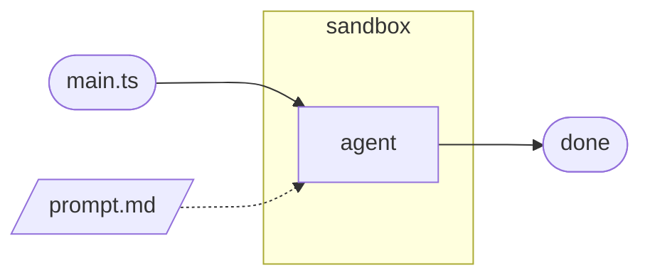
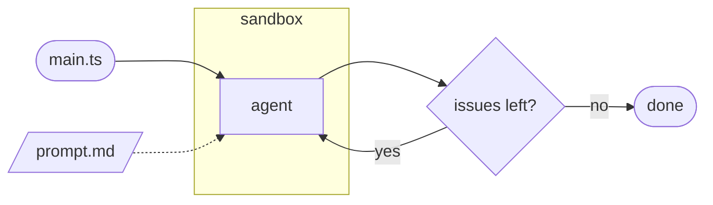
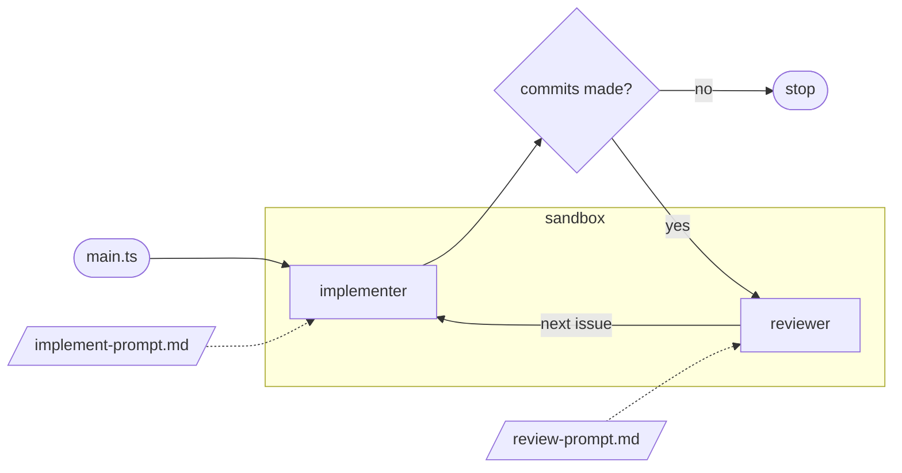
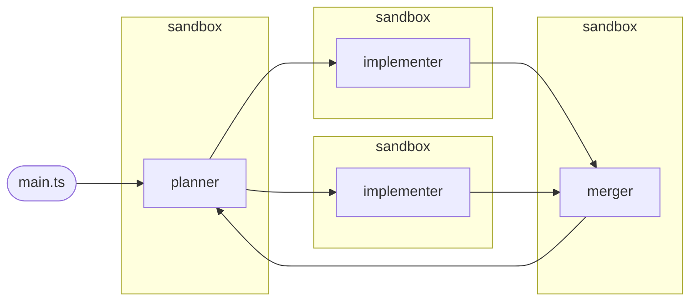
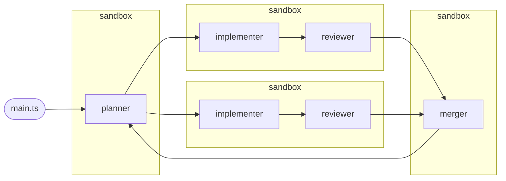

## Sandcastle templates

There are a couple of defaults to choose from, each `npx @ai-hero/sandcastle init .` scaffolds a `.sandcastle/main.mts` orchestration script plus prompt files.

<!--
Source: https://github.com/mattpocock/sandcastle/tree/main/src/templates
-->

---

## blank

* Prompt is empty boilerplate.

<!--
Bare scaffold — write your own prompt and orchestration.
Single run, maxIterations: 1 by default, no branch/merge logic — you own everything.
-->

---

## simple-loop

* Prompt reads the next issue via `bd ready --json`.

<!--
Picks issues one by one and closes them.
maxIterations: 3+, branchStrategy: merge-to-head — each iteration works one issue and merges straight back to HEAD.
-->

---

## sequential-reviewer

* Each phase is still a **new Claude session** — implementer and reviewer don't share conversation context, only the branch's files/commits.

<!--
Implements issues one by one, with a code review step after each.
Loop stops early once an implement phase produces no commits (backlog empty).
-->

---

## parallel-planner

<!--
Plans parallelizable issues, executes on separate branches, merges.
Planner outputs a <plan> JSON (issue id, title, target branch) validated with Zod.
Implementers run concurrently via Promise.allSettled — one failing agent doesn't cancel the others.
Only branches with commits are passed to the merger; loop repeats to pick up newly unblocked issues.
-->

---

## parallel-planner-with-review

<!--
Plans parallelizable issues, executes with per-branch review, merges.
Each issue gets its own sandbox — implementer runs first, reviewer only runs if commits were made, same branch.
Combines the review gate of sequential-reviewer with the concurrency of parallel-planner.
-->
