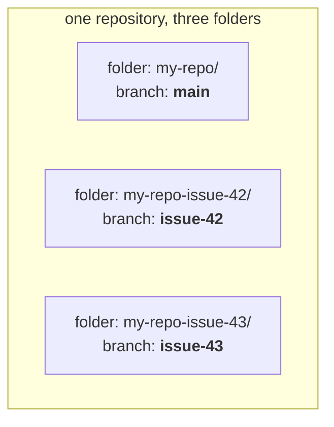

How is code separated from each other?

# Intermezzo


---

## Plan git parallel issue


one clone = one folder = **one branch at a time**.

* To touch another branch you `git switch` — and your files change underneath you. 
  * Uncommitted work? Stash it first.
  * Does not work with parallel work.


---

## Worktree solution

**A worktree is a second folder on disk, checked out on a different branch, belonging to the same repo.**


<div class="flex justify-center">



</div>


<!--
Quick intermezzo, because the next slide does not land unless this one does. Worktrees are
a git feature a lot of people have simply never had a reason to use, so let's do it
properly.

Start from the thing you already know. A clone gives you one folder. That folder is on one
branch. If you want to work on a different branch, you switch — and the files in that
folder are rewritten in place. If you had uncommitted work, you stash it first. One folder,
one branch, always.

That is a real constraint the moment you want two things happening at once. The old
workaround was to clone the repo a second time — which downloads everything again, and then
you have two repos that don't know about each other.

A worktree is the proper answer. It is a second folder on your disk, checked out on a
different branch, and it belongs to the same repository. Look at the diagram: three folders,
three branches, all live at the same time — and one shared set of commits, branches and
remote underneath them.

So it is not a copy. Nothing is downloaded, nothing is duplicated. Creating one is
essentially instant, and you can throw it away just as cheaply.
-->

---

[//]: # TODO, clarify with a image showing two folders on 2 different branches()

[//]: # TODO, maybe show:
```
main/.git    drwxr-xr-x   ← real directory
feat/.git    -rw-r--r--   ← a 192-byte *file*

The file contains one line:

gitdir: /…/main/.git/worktrees/feat

That's a "gitlink" — a pointer. Git reads it and redirects to the named directory.

What's in the main repo's .git/

COMMIT_EDITMSG  config  description  HEAD  hooks/  index  info/  logs/  objects/  refs/  worktrees/

Normal stuff, plus worktrees/ — one subdirectory per linked worktree.

What's in .git/worktrees/feat/
```


---

## `git worktree` in practice

```bash
git worktree add ../my-repo-issue-42 sandcastle/issue-42   # new folder, that branch
git worktree list                                          # show them all
git worktree remove ../my-repo-issue-42                    # tidy up
```